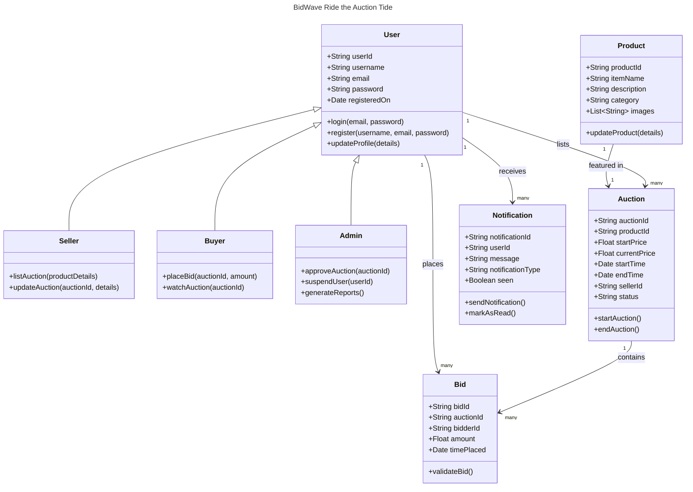

 # BidWave: Ride the Auction Tide

## Description
 Building an online marketplace where users can list items for sale in a timed auction format, with real-time bidding and notifications for participants. This project includes an admin dashboard for managing listings and bids

# Domain Object Model
## Domain Model for BidWave: Ride the Auction Tide


## How to Run the Project

Follow these steps to set up and run the project:

1. **Install frontend dependencies**:
   - Navigate to the frontend directory and install the required dependencies:
     ```bash
     npm install
     ```

2. **Run the frontend UI**:
   - Start the frontend development server:
     ```bash
     npm run dev
     ```
   - The frontend will be available at `http://localhost:3000`.

3. **Install backend dependencies**:
   - Navigate to the backend directory and install the required dependencies:
     ```bash
     npm install
     ```

4. **Run the backend API**:
   - Start the backend server:
     ```bash
     node server.js
     ```
   - The backend will be available at `http://localhost:5000`.

Make sure both the frontend and backend are running to fully interact with the application.

recording and ppt: https://northeastern-my.sharepoint.com/:f:/g/personal/jinkaradhakrishna_s_northeastern_edu/ErrmuoIisCZGnV3rD2F0pFkBJHQfJxWIeyGPCZfJJdZnfg?e=gZpSIx

## Team Members

- Aadarsh Ravi(ravi.add@northeastern.edu)
- Rohan Reddy Patlolla(patlolla.ro@northeastern.edu)
- Rahul Reddy Patlolla(patlolla.ra@northeastern.edu)
- Swathi Jinka Radhakrishna(jinkaradhakrishna.s@northeastern.edu)
